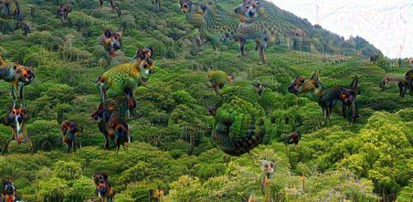

# Josef Brechler
# Data science projects portfolio

Hi there, 

here you can find portfolio of several projects I have done mostly for fun, to educate myself and, well, to show what I am capable of working with. The projects are sorted chronologically, the newest projects being at the top.
___

## Deepdream exploration

**Notable technologies and methods**

 - `Python 3.5`
 - `TensorFlow`
 - `Convolutional neural networks (CNN)`
 
**Summary**

I had a lot of fun with this project. It is an extension to the [Deepdream notebook from Tensorflow tutorials](https://github.com/tensorflow/tensorflow/blob/master/tensorflow/examples/tutorials/deepdream/deepdream.ipynb). I explore behaviour of the Google's pretrained Inception5h CNN in terms of parameters tweaking, applying layers' filters on own images as well as visualizing layers themselves.
 
**Links**

 - [GitHub repo](https://github.com/pepaczz/deepdream_exploration)
 - [ipynb notebook](https://github.com/pepaczz/deepdream_exploration/blob/master/codes/deepdream_explor_20180403a.ipynb) - Due to a lot of visualizations the binary is rather large (16 MB) and reloading might be necessary to show it in GitHub. If problems prevail please download the html and open it on your computer. It is worth it!
 - [exported html](https://raw.githubusercontent.com/pepaczz/deepdream_exploration/master/codes/deepdream_explor_20180403a.html) - please save the html to your desktop to display it

___

## Plant Seedlings Classification (Kaggle competition)

**Notable technologies and methods**

 - `Python 3.5`
 - `Dimensionality reduction techniques`
 - `Convolutional neural networks (CNN)`
 - `Image data augmentation`
 - `Object-oriented programming`
 - `Keras`

**Summary**

This project is related to the [Kaggle competition](https://www.kaggle.com/c/plant-seedlings-classification). There are two mian goals pursued. First, to show how dimensionality reduction techniques, such as PCA and t-SNA, work on image data. Second, to classify the data using convolutional neural network (CNN)

**Links**

 - [repository homepage](https://github.com/pepaczz/kaggle_plants/blob/master/README.md)
 - [dimensionality reduction results and visualizations](https://github.com/pepaczz/kaggle_plants/blob/master/codes/plants_dimension_reduce_20180405b.ipynb)
 - [model estimation](https://github.com/pepaczz/kaggle_plants/blob/master/codes/plants_cnn_model_fit_20180415c.py)
 - [model evaluation](https://github.com/pepaczz/kaggle_plants/blob/master/codes/plants_cnn_model_evaluation_20180410c.ipynb)

___

## Titanic Kaggle competition

**Notable technologies and methods**

 - `Python 3.5`
 - `Exploratory data analysis (EDA)`
 - `Scikit-learn pipeline with custom transformers`
 - `Random forest classifier`
 - `TPot library (automated machine learning)`

**Summary**

Several scripts related to the [Titanic Kaggle competition](https://www.kaggle.com/c/titanic). I include various visualizations in the exploratory data analysis. Then I constructed a scikit-learn pipeline with custom transformers to preprocess the data to prepare them for the machine learning. Another supplementary script shows how different estimators behave on these data in terms of precision-recall tradeoff.

**Links**

 - [GitHub repository](https://github.com/pepaczz/kaggle_titanic)
 - [Exploratory data analysis (EDA)](https://github.com/pepaczz/kaggle_titanic/blob/master/codes/exploratory_analysis_Kaggle_submission_20180307.ipynb)
 - [Random forest classifier](https://github.com/pepaczz/kaggle_titanic/blob/master/codes/submission_RandomForestClassifier_20180307a.py)
 - [Precision-recall comparison](https://github.com/pepaczz/kaggle_titanic/blob/master/codes/precision_recall_comparison_20180326.ipynb)

___

## Recommender system

**Notable technologies and methods**

 - `R`
 - `Recommender system`
 - `Item-based collaborative filtering`
 - `Matrix factorization`
 - `Arguments parsing`
 
**Summary**

In this repository I constructed a recommender system, i.e. an algorithm that models users' preferences on items, being it products to sell, books, movies etc. Several methods of estimation are available - popular items, matrix factorization and item-based collaborative filtering. Each of these techniques is suitable for different situations as some of the techniques require certain amount of input data to provide reasonable results.

**Links**

Currently not deployed as a public repository.

___

## Wahammer Fantasy Battles calculator

**Notable technologies and methods**

 - `R`
 - `Shiny`
 - `Monte carlo simulations`
 
**Summary**

This utility calculates probability of one player succeding over another in the tabletop game Warhammer Fantasy Battles ( (c) Games Workshop Ltd.). Monte Carlo simulation is used to estimate probability density of distributions. A motivation for this technique is that the playing system is based on several succeeding rolls of 6-sided dices and therefore generating whole range of stochastic outcomes.

**Links**

 - [Shiny web application](https://josefbre.shinyapps.io/Warhammer_probCalculator_v_0_1/)
 - [GitHub repository](https://github.com/pepaczz/warhammer)
