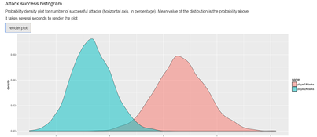

# Projects portfolio

Hi there, 

Here you can find a portfolio of selected non-work projects that I have dealt with in the past.

 - >[Variational autoencoders](#vae)
 - >[Tabletop game Warcry simulation with reinforcement learning](#digger)
 - >[Option pricing; stochastics calculus with MC simulations](#derivatives)
 - >[Data science and ML teaching](#teach)
 - >[Stocks intrinsic value estimation](#algo)
 - >[Wahammer Fantasy Battles calculator](#wfb)

___

## Variational autoencoders with Bayesian inference

**Notable technologies and methods**

 - `Variational autoencoders`
 - `Convolution neural networks in TensorFlow`
 - `Bayesian inference`

**Summary**

Purpose of the project is to use variational autoencoder to create *facial composites* - a widely used forensics method to generate images of suspects. Random faces are sampled as points in latent low-dimensional space and decoded as face images. A user (a witness) is then asked to assign scores to each generated image. In every further iteration new image is generated so that is maximizes its score (conditioning on scores from previous iterations). It is the solution of the final project of the Bayesian Methods for Machine Learning MOOC course. 

**Links**

- [GitHub repository](https://github.com/pepaczz/bmfml)

___

## Warcry tabletop game simulator with reinforcement learning

**Notable technologies and methods**

 - `Neural networks in PyTorch`
 - `DQN Reinforcement Learning`
 - `Shortest path in 2D space with obstacles`

**Summary**

I call this project Digger. Purpose is to create an environment for training and evaluating reinforcement learning agents in the context of tabletop wargame Warcry. Beside having fun and learning something new, my motivation is to create a tool that would allow me to test new strategies and train myself in the Warcry game. This is project in development.

**Links**

- [Project summary (pdf)](./documents/digger_project_summary.pdf)
- [GitHub repository](https://github.com/pepaczz/digger)

___

## Option pricing and stochastic processes

**Notable technologies and methods**

 - `Option pricing and implied volatility calculation`
 - `Stochastic calculus using Monte carlo simulations`

**Summary**

This repository contains two exercies related to option pricing and stochastic calculus.

1. A notebook that replicates the results which are shown in the [blog post by John Hull](https://fincad.com/blog/interest-rate-models-and-negative-rates). Main purpose of this blog post is to show that using Black-Scholes model in the environment of very low or negative interest rates implies some implausible properties. More precisely, a shift is introduced to the log-normal distribution to allow for negative interest rates. However, implied volatiliy is heavily dependent on the size of the shift parameter. To overcome this issue, Bachelier model is used instead which uses normal distribution instead of the log-normal one and therefore allows for the negative interest rates without using the shift parameter.
2. A notebook that uses Monte Carlo simulations to find the maximum of two correlated Weiner processes at given time period.

**Links**

- [GitHub repository](https://github.com/pepaczz/derivatives)
___

## Data science and ML teaching

**Summary**

I have been developing and teaching introductory data science and ML courses for robot_dreams teaching platform. Here I provide few example lesson materials.

**Links**

 - [lesson on classification (in Czech; large pdf file, better to download)](./lessons/L03_klasifikace_cast1.pdf)
 - [lesson on regularization (in Czech; large pdf file, better to download)](./lessons/L8_cast3.pdf)
___

## Stocks intrinsic value estimation

**Notable technologies and methods**

 - `Intrinsic value estimation`
 - `Optimization`
 - `SEC filings data`
 
**Summary**

Purpose of this project is to provide a basic tool for stock intrinsic value estimation. The tool is based on the discounted cash flow (DCF) model and uses historical financial data to estimate the intrinsic value of a stock. A trading strategy that is based on the intrinsic value is being developed. 
 
**Links**

 - [Project summary (pdf)](./documents/algo_project_summary.pdf)
 - [GitHub repository](https://github.com/pepaczz/algo)
___

## Older project: Wahammer Fantasy Battles calculator

**Notable technologies and methods**

 - `R`
 - `Shiny`
 - `Monte carlo simulations`
 
**Summary**

This utility calculates probability of one player succeding over another in the tabletop game Warhammer Fantasy Battles ( (c) Games Workshop Ltd.). Monte Carlo simulation is used to estimate probability density of distributions. A motivation for this technique is that the playing system is based on several succeeding rolls of 6-sided dices and therefore generating whole range of stochastic outcomes.

**Links**

 - [Shiny web application](https://josefbre.shinyapps.io/Warhammer_probCalculator_v_0_1/)
 - [GitHub repository](https://github.com/pepaczz/warhammer)
