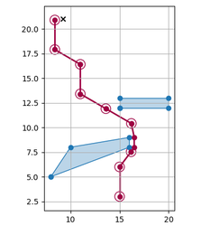
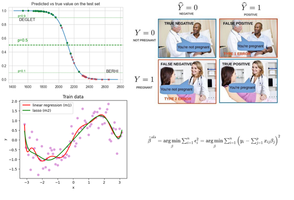

# Projects portfolio

Hi there, 

here you can find portfolio of several projects I have done mostly for fun, to educate myself and, well, to show what I am capable of working with. The projects are sorted chronologically, the newest projects being at the top.

 - >[Stocks intrinsic value estimation](#algo)
 - >[Tabletop game Warcry simulation with reinforcement learning](#digger)
 - >[Data science and ML teaching](#teach)
 - >[Older project: Wahammer Fantasy Battles calculator](#wfb)

___

## Stocks intrinsic value estimation

**Notable technologies and methods**

 - `Intrinsic value estimation`
 - `Optimization`
 - `SEC filings data`
 
**Summary**

Purpose of this project is to provide a basic tool for stock intrinsic value estimation. The tool is based on the discounted cash flow (DCF) model and uses historical financial data to estimate the intrinsic value of a stock. A trading strategy that is based on the intrinsic value is being developed. 
 
**Links**

 - [Project summary](./documents/project_summary.pdf)
 - [GitHub repository (private)](https://github.com/pepaczz/algo)

___

## Tabletop game Warcry simulation with reinforcement learning

**Notable technologies and methods**

 - `Neural networks in PyTorch`
 - `DQN Reinforcement Learning`
 - `Shortes path in 2D space with obstacles`

**Summary**

I call this project Digger. Purpose is to create an environment for training and evaluating reinforcement learning agents in the context of tabletop wargame Warcry. Beside having fun and learning something new, my motivation was to create a tool that would allow me to test new strategies and train myself in the Warcry game.

**Links**

[GitHub repository (private)](https://github.com/pepaczz/digger)
___

## Data science and ML teaching

**Summary**

I have been developing and teaching introductory data science and ML courses for robot_dreams teaching platform. Here I provide few example lesson materials.

**Links**

 - [classification](./lessons/L03_klasifikace_cast1.pdf)
 - [regularization](./lessons/L8_cast3.pdf)
 
___

## Older project: Wahammer Fantasy Battles calculator

**Notable technologies and methods**

 - `R`
 - `Shiny`
 - `Monte carlo simulations`
 
**Summary**

This utility calculates probability of one player succeding over another in the tabletop game Warhammer Fantasy Battles ( (c) Games Workshop Ltd.). Monte Carlo simulation is used to estimate probability density of distributions. A motivation for this technique is that the playing system is based on several succeeding rolls of 6-sided dices and therefore generating whole range of stochastic outcomes.

**Links**

 - [Shiny web application](https://josefbre.shinyapps.io/Warhammer_probCalculator_v_0_1/)
 - [GitHub repository](https://github.com/pepaczz/warhammer)
